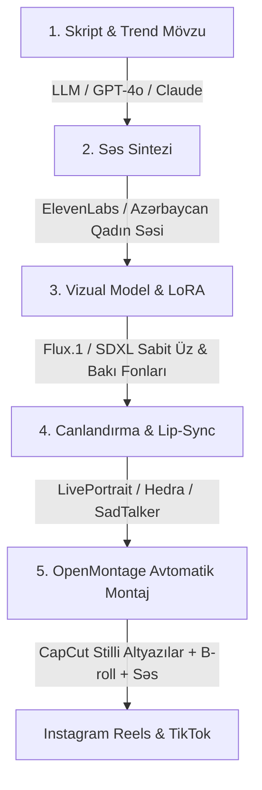

# 🌟 AI Influencer Studio: Virtual Sosial Media Fenomeni Layihəsi

## 🎯 Layihənin Məqsədi və Baxışı
Azərbaycan sosial media bazarı (Instagram Reels, TikTok) üçün süni intellekt əsaslı **Virtual Qadın Fenomen (AI Influencer)** yaratmaq, onun vizual simasını (face consistency) sabit saxlamaq, təbii Azərbaycan dilində danışdırmaq və **OpenMontage / Avtomatlaşdırılmış Video Boru Xətti** vasitəsilə gündəlik yüksək baxışlı qısa videolar (Reels/TikTok) istehsal edərək brend reklamları və tərəfdaşlıqlar üzərindən stabil gəlir axını qurmaq.

---

## 🏛️ Texnoloji Boru Xətti (AI Generation & Video Pipeline)

---

## 🛠️ Əsas Texnologiyalar və Alətlər

| Mərhələ | Texnologiya | Təyinatı |
| :--- | :--- | :--- |
| **1. Vizual Simanın Yaradılması** | `Flux.1` / `SDXL LoRA` / `FaceID` | Hər şəkildə və videoda 100% eyni üz, göz və saç quruluşunu sabit saxlamaq |
| **2. Səs və Nitq** | `ElevenLabs` / `Azure TTS` | Təbii, emosional və cəlbedici Azərbaycan dilli qadın səsi |
| **3. Canlandırma & Dodaq Sinxronu** | `LivePortrait` / `Hedra` / `Wav2Lip` | Şəkli səsə uyğun canlı mimika və dodaq hərəkətləri ilə danışdırmaq |
| **4. Avtomatik Montaj** | `OpenMontage` / `MoviePy` / `FFmpeg` | Dinamik sözbəsöz yanan altyazılar, yaxınlaşma effektləri, fon musiqisi |
| **5. Skript və Mövzu** | `Claude` / `OpenRouter` | Viral hook-lar, Bakı gündəmi, maraqlı hekayələr və məsləhətlər |

---

## 💰 Monetizasiya Strategiyası (Azərbaycan Bazarı)

1. **Lokal Brend Reklamları (10k–50k izləyicidən sonra)**:
   - Kosmetika, gözəllik salonları, geyim butikləri, qadın aksesuarları.
   - Restoran, kafe və Bakı məkanlarının təqdimatı.
   - Texnoloji tətbiqlər və xidmətlər.
2. **Affiliate Marketing (Komissiya Qazancı)**:
   - Trendyol, AliExpress və yerli e-ticarət mağazalarından "məsləhət görülən" məhsul linkləri.
3. **Panelim.az & Öz Məhsullarının Tanıdılması**:
   - Modelin səhifəsi vasitəsilə öz rəqəmsal xidmətlərimizə və mağazalarımıza birbaşa trafik çəkmək.

---

## 📊 Mərhələli İnkişaf Planı (Roadmap)

- **Mərhələ 1 (MVP Personaj & Pipeline)**: Modelin vizual konseptini (ad, sima, xarakter) təyin etmək, 1 test videosunu sıfırdan son montajına qədər çıxarmaq.
- **Mərhələ 2 (Kanalın Açılışı & Gündəlik İstehsal)**: Instagram və TikTok hesablarını açmaq, gündə 1-2 Reels formatında kontent paylaşmaq.
- **Mərhələ 3 (Auditoriya Böyüməsi & SMM)**: Panelim.az vasitəsilə ilkin aktivliyi artırmaq, trend musiqi və viral mövzularla 10k izləyici hədəfinə çatmaq.
- **Mərhələ 4 (Monetizasiya)**: Yerli brendlərə reklam paketləri təklif etmək və gəlir əldə etmək.
